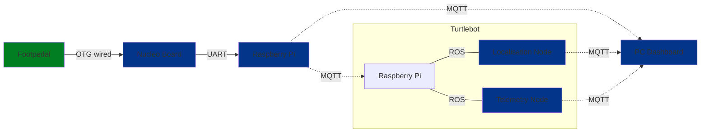

# Venus-Blue: Turtlebot Control with Footpedals with Localisation Display

## Project Brief:
This project involves using the Raspberry Pi platform. A small rover chassis should be controlled, to drive a circuit in a 2m X 2m
space. The speed and direction of the rover should be controlled by the Foot Pedal. The Foot Pedal should be connected via USB OTG to the
nucleo board, which should then broadcast the commands via ROS. The rover should also be tracked with a motion model and the onboard
LiDar, with the display on either using a web dashboard.

## Project System Overview
The overview block diagram of the system is shown here. There are four main nodes:
- Nucleo Board Node: which processes data from the peripherals (foot pedals) and transmits to as raspberry Pi using serial. This process is handled in zephyr
- Raspberry Pi Node: which receives data from the Nucleo board and publishes the data to a specified MQTT topic in JSON format
- PC Dashboard Node: Receives the localisation information and peripheral information via MQTT and displays it on a web interface
- Turtlebot Node: the robot to be controlled. It receives driving information via MQTT and publishes to a ROS network. Then, publishes the localised position of the turtlebot to MQTT. 

The block diagram below uses dashed lines to represent wireless network connection and solid lines for wired connections. 



## User Guide

### Hardware

Components required:
- Footpedal
- Nucleo board.
- USB A to micro cables.

Setup:
- Using a USB A to micro cable, plug the foot pedal into the Nucleo board.
- Using a second cable, plug the Nucleo board into the host machine.

### Turtlebot Controller

Clone the repository:
```bash
git clone https://github.com/RachelChiong/Venus-Blue.git
```

Start the serial comms MQTT node:

```python
cd pedal && python3 pi_serial.py
```

Initialise the ROS environment to point to the TurtleBot (This is for a waffle_pi with domain id 32, change these values for another turtlebot model or domain id):
```bash
export ROS_DOMAIN_ID=32
export TURTLEBOT3_MODEL=waffle_pi
export RMW_IMPLEMENTATION=rwm_cyclonedds_cpp
source /opt/ros/humble/setup.bash
```

Build and run the controller. The MQTT server can be selected by passing `mqtt_server`, `mqtt_port` arguments to `ros2 run`.

```bash
source /opt/ros/humble/setup.bash
cd turtlebot
colcon build --sylink-install --packages-select venusbluepy
source /install/setup.bash
ros2 launch venusblue venusblue.launch
```

### Visualisation Dashboard

**Pre-requisites:**
- Docker
- Docker-compose
- UQ internet connection (to interact with MQTT nodes)

**Tech-stack:**
- React-Typescript (frontend)
- Flask-Python (backend) 

**Steps:**
1. Ensure docker is running
2. Go to ```dashboard/``` and run
```sh
docker-compose up
```
This should spin up two sub-containers.
- frontend: ```localhost:3000```
- backend: ```localhost:5001```

3. To close the dashboard, run
```sh
docker-compose down -v
```
